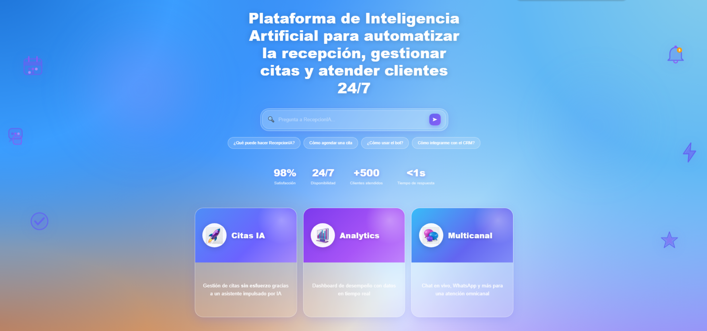
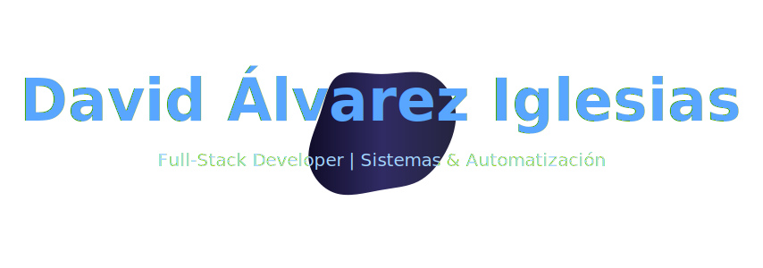

  

  
  
  
  

---

## 📂 Sobre mí

🏦 **Experiencia**

Full Stack Developer con foco en aplicaciones data-driven y desarrollo de soluciones basadas en IA. Recientemente he trabajado en distintos proyectos que integran:
React, Python, APIs, bases de datos y servicios cloud, desarrollando funcionalidades completas desde el backend hasta el frontend y construyendo productos funcionales end-to-end.

💻 **Ahora**

Actualmente en formación continua en desarrollo de software, tecnologías multiplataforma y ecosistema Microsoft (Power Platform, automatización y análisis de datos). Construyendo productos full stack reales con IA.

---

🌍 **Madrid, España** &nbsp;|&nbsp; 💼 **Open to work** 🟣 &nbsp;|&nbsp; 🗣️ **Español 🇪🇸 · English 🇬🇧** &nbsp;|&nbsp; 🎓 **DAM · UAX** &nbsp;|&nbsp; ⚡ **Software en producción**

---

## 🧠 Mi stack tecnologico

### ⚙️ Core / Backend

### 🎨 Frontend

### 🤖 AI

### 🌐 External APIs

### ⚡ Realtime / Data

### 🧰 Tools & Analytics

---
## 🚀 Proyectos Destacados

---

### 🏠 Trasteando

Plataforma de gestión de trasteros con **geolocalización, pagos y mensajería en tiempo real**.

⚛️ React · 🐍 Flask · 🐘 PostgreSQL · 🔐 JWT multi-rol · ⚡ Socket.IO · 💳 Stripe · 🗺️ Google Maps · 🤖 OpenAI

**Equipo:** David · Irene · Sergio  

---

### 🤖 AI Receptionist SaaS

SaaS de **recepcionista IA** para negocios con landing, autenticación y dashboard analítico.

⚛️ React · 🎨 Tailwind · 🤖 OpenAI · 🔐 JWT · 📊 Dashboard

🚧 **Estado:** En desarrollo activo

## 🚀 Proyectos Destacados

---

### 🏠 Trasteando

  

Plataforma de gestión de trasteros con **geolocalización, pagos y mensajería en tiempo real**.

⚛️ React · 🐍 Flask · 🐘 PostgreSQL · ⚡ Socket.IO · 💳 Stripe · 🗺️ Google Maps · 🤖 OpenAI

**Equipo:** David · Irene · Sergio

---

### 🤖 AI Receptionist SaaS

  

SaaS de **recepcionista IA** que automatiza la atención al cliente, gestión de citas y conversaciones.

⚛️ React · 🤖 OpenAI · 🔐 JWT · 💬 WhatsApp API · 🗄 Supabase · ⚡ n8n

**Estado:** 🚧 En desarrollo activo

---
<!--
## 🚀 Proyectos Destacados

### 🏠 Trasteando
> Plataforma de gestión de trasteros con geolocalización y pagos integrados

⚛️ React &nbsp;·&nbsp; 🐍 Flask + SQLAlchemy ORM &nbsp;·&nbsp; 🐘 PostgreSQL &nbsp;·&nbsp; 🔐 JWT multi-rol &nbsp;·&nbsp; ⚡ Socket.IO &nbsp;·&nbsp; 💳 Stripe &nbsp;·&nbsp; 🗺️ Google Maps &nbsp;·&nbsp; 🤖 OpenAI

**Equipo:** David · Irene · Sergio

---

### 🤖 AI Receptionist SaaS
> SaaS de recepcionista IA con landing page, autenticación y dashboard

⚛️ React + Tailwind CSS &nbsp;·&nbsp; 🤖 OpenAI &nbsp;·&nbsp; 🔐 JWT Auth &nbsp;·&nbsp; 📊 Dashboard analítico

**Estado:** 🚧 En desarrollo activo

---

## 📊 GitHub Stats

---

## 🔥 Actividad

---
-->

## 👁️ Vistas

---

## 🎮 My GitHub Contributions Snake

  <picture>
    <source media="(prefers-color-scheme: dark)" srcset="https://raw.githubusercontent.com/daalvarezig/daalvarezig/output/github-contribution-grid-snake-dark.svg">
    <source media="(prefers-color-scheme: light)" srcset="https://raw.githubusercontent.com/daalvarezig/daalvarezig/output/github-contribution-grid-snake.svg">
    
  </picture>

---

## 💬 Dev Quote

> ### "Venía de gestionar sistemas críticos. Ahora construyo los míos."
> 

<!--

-->

